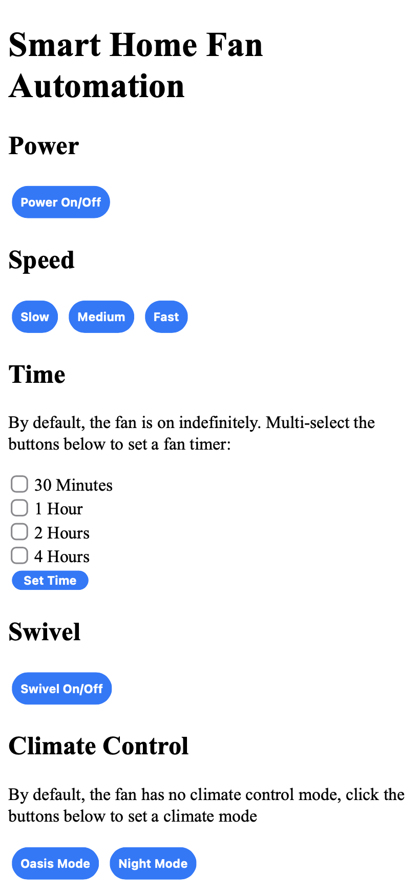
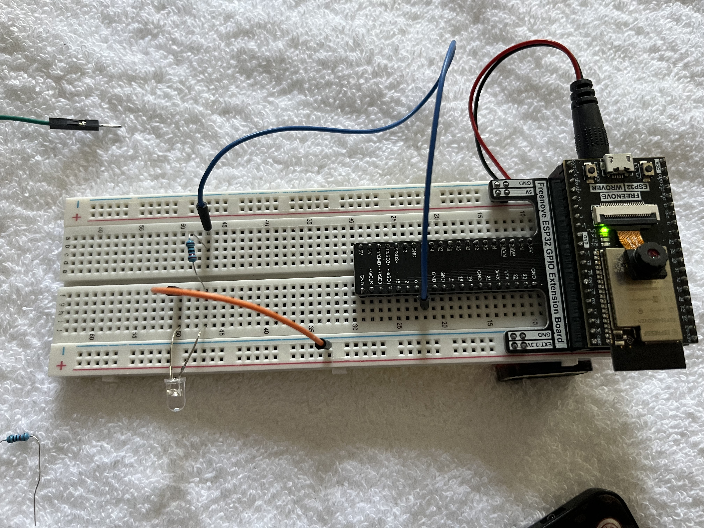

 
  

  

  <h2 align="center">SmartBreeze</h2>
  

    Connecting a conventional fan to the smart home
  

Video Demo:

Code Walkthrough: https://youtu.be/BlxzoqkXItQ

## Table of Contents

* [About the Project](#about-the-project)
* [Photos](#photos)

## About The Project

SmartBreeze connected my "dumb" pedestal fan to the smart home, allowing for control with my Google Home (including voice commands) and control though a web server hosted on the microcontroller.

I programmed the ESP32 MCU in C++ and connected it with the Google Home framework using [Sinric Pro](https://sinric.pro/). I also implemented all the controls from the original remote on to a web server in HTML/CSS that I hosted on the ESP32.

The circuit involves an infrared emitter connected to an ESP32 microcontroller, the fan controls were replicated using an infrared receiver and were then sent using the emitter. Since the fan did not use any conventional IR protocols (like NEC, Sony, Samsung, etc.) I leveraged RAW infrared communication to collect the timestamps the IR diode was on and replicated those values.

## Photos
Below can be seen the web page hosted on the ESP32, any options selected on this get sent to the fan.

Below can be seen the final circuit, a 9V battery is connected to the ESP32 for power.

